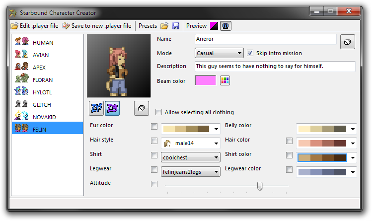

# SB Character Creator
What we have here is the solution to the problem that *Starbound*'s character creator quickly gets unwieldy.

## Rationale
Does anyone remember what the character creator in *The Sims* looked like? The original? [It wasn't pretty](<https://www.mobygames.com/game/windows/sims/screenshots/gameShotId,4284/>), with arrow buttons for the two visual elements you could change. Install enough content and you could need tens of clicks to reach the option you wanted, only to find you could've gone the *other* way and reach it in two. *The Sims 2* did [much better](<https://www.mobygames.com/game/windows/sims-2/screenshots/gameShotId,85645/>) with a scrolling panel full of previews. *Starbound* has the same basic issue as *The Sims* in that it has *several* different options, each with their own arrow buttons and not a clue. The only real constant is that the clothing colors are limited. Now consider there are by default only seven buttons to select a species for your character. To play as a custom species you got from a mod, you need *another* mod to [add more blank species buttons](<https://steamcommunity.com/sharedfiles/filedetails/?id=729426722>).

Adding more species buttons and changing the basic layout is all we can do here. We can't make it more like *The Sims 2* if we wanted to.

*So I made this.*

## Features
* *Mod support* - Any PAK file with well-formed metadata and any mod folder. Just edit `sources.txt` to fit and the application will do its best.
* *Mono support* - Sure, it's a .Net application. Doesn't mean it can't work on Linux or MacOS via Mono. We tried.
* *Previews* - They may be a little small but those dropdown lists *do* count as scrolling panels with previews.
* *Export* - You can export your current character's preview as a 1:1 scale PNG file with a transparent background.
* *Edit* - You can import an *existing* character and tweak their looks. Give them a custom description or Matter Manipulator beam color... you just can't edit their inventory. That'd be cheating.
* *Name generator* - I took special care to ensure both the old style and the Markov-based name generators work as they do in-game.
